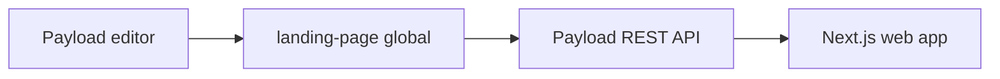

The web landing page is backed by the public `landing-page` Payload global. Its
schema lives in `apps/cms/dev/globals/LandingPage.ts`.

## Edit the landing page

1. Start the CMS with `bun run dev --filter=cms`.
2. Open `http://localhost:3002/admin`.
3. Select **Landing Page** under **Website**.
4. Update the hero, actions, features, or footer.
5. Save the global.

The web app reads the global through Payload's REST endpoint:

```http
GET /api/globals/landing-page
```

## Content lifecycle



<Info>
  Public read access is enabled for this global because the content is intended
  for the public landing page. Keep write access restricted to authenticated
  Payload users.
</Info>
